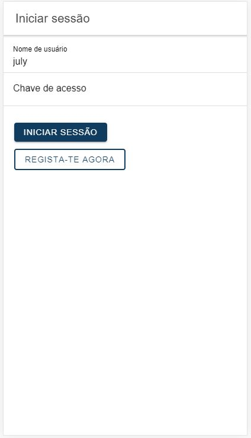
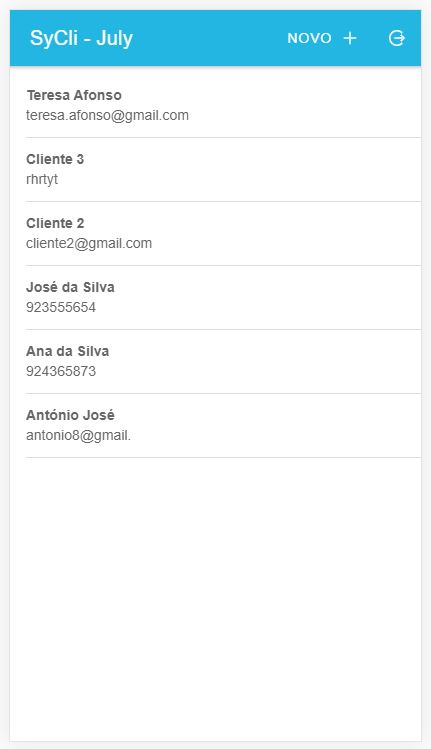

# ionic4-mysql-crud-and-auth
CRUD Completo em Ioinic 4 consumindo uma api em 
PHP e Mysqli com autenticação de usuários.

## Requisitos

* Ter instalado o Node.js
* Ter instalado o Xampp ou um programa similar
* Ter instalado o Ionic devidamente configurado.

## Instalação

* Copie os ficheiros da pasta ionic-crud para uma pasta no seu computador;
* Copie a pasta api para o seu servidor PHP
* Altere as configurações de conexão no ficheiro DB.php da pasta api/lib
* No projecto ionic, abra o ficheiro post-providers.ts e altere para o link
que configurou para a para no servidor php.
* E... Já está...

## Motivação
Escrevi este micro projecto para melhorar as minhas habilidades com o Ionic e principalmente 
para aumentar o meu nível com [angular](http://angular.io), 
seguindo alguns videos do Youtube.

É um exercício bem prático onde aplico conceitos fundamentais
como a manipulação de base de dados com angular e a gestão de autenticação
de usuários

## Falhas e Melhorias?

O projecto contêm alguns erros que devem ser melhorarados. E algumas
 páginas devem ser actualizadas também por não seguirem boas práticas.

